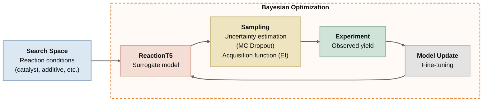

# Bayesian Optimization of Reaction Conditions using ReactionT5

Bayesian optimization of chemical reaction conditions using the pretrained Transformer model [ReactionT5v2](https://github.com/sagawatatsuya/ReactionT5v2). Predictive uncertainty is estimated via MC Dropout.

## ReactionT5-based Bayesian Optimization Workflow



## Datasets

| Dataset | Reaction Type | Source |
|---------|--------------|--------|
| **Buchwald-Hartwig (BH)** | Buchwald-Hartwig amination | [rxn_yields](https://github.com/rxn4chemistry/rxn_yields/tree/master/data/Buchwald-Hartwig) |
| **Suzuki-Miyaura (SM)** | Suzuki-Miyaura coupling | [rxn_yields](https://github.com/rxn4chemistry/rxn_yields/tree/master/data/Suzuki-Miyaura) |
| **NiB** | Ni-catalyzed borylation | [ochem-data](https://github.com/doyle-lab-ucla/ochem-data/tree/main/NiB) |

### Pretraining Dataset (ORD)

The Open Reaction Database (ORD) dataset is required to run the pretraining data comparison notebooks (`notebooks/visualize_dataset_overlap.ipynb` and `notebooks/visualize_dateset_umap.ipynb`). Download it from [Google Drive](https://drive.google.com/file/d/1JozA2OlByfZ-ILt5H5YrTjLJvSvD8xdL/view) and place it as follows.

```
ReactionT5-bo-yield/
└── data/
    └── ORD/
        └── all_ord_reaction_uniq_with_attr20240506_v3_train.csv
```


## Methods

| Method | Model | Features | Script | Role |
|--------|-------|----------|--------|------|
| **ReactionT5 BO** | ReactionT5v2 + MC Dropout | Reaction SMILES | `scripts/bo_yield/` | **Proposed** |
| **GNN BO** | GNN + MC Dropout | Molecular graphs | `scripts/gnn/` | Baseline |
| **GPR BO** | Gaussian Process Regression | Morgan Fingerprint | `scripts/gpr/` | Baseline |
| **Optuna TPE** | Tree-structured Parzen Estimator | Categorical conditions | `scripts/optuna_tpe/` | Baseline |

## Setup

**Requirements:** Python 3.11+, CUDA GPU (recommended)

```bash
git clone https://github.com/kazumasa-okamoto/ReactionT5-bo-yield
cd ReactionT5-bo-yield

# Install with uv
uv sync

# Or with pip
pip install -e .
```

## Project Structure

```
ReactionT5-bo-yield/
├── scripts/
│   ├── bo_yield/           # ReactionT5 BO (pretrained transformer-based)
│   ├── gnn/                # GNN BO (graph neural network-based)
│   ├── gpr/                # GPR BO (fingerprint-based)
│   └── optuna_tpe/         # Optuna TPE (categorical parameter-based)
├── notebooks/
│   ├── bo_yield_*.ipynb    # ReactionT5 BO experiments
│   ├── gpr_yield_*.ipynb   # GPR BO experiments
│   ├── optuna_yield_*.ipynb # Optuna TPE experiments
│   ├── greedy_yeaild_*.ipynb # ReactionT5 greedy selection expreriments
│   ├── gnn_yield.ipynb     # GNN BO experiments
│   ├── visualize_all_results.ipynb    # Cross-method result comparison
│   ├── visualize_dataset_overlap.ipynb # Dataset overlap analysis
│   └── visualize_dateset_umap.ipynb   # UMAP embedding visualization
├── data/
│   ├── NiB/
│   ├── Suzuki-Miyaura/
│   ├── Buchwald-Hartwig/
│   └── ORD/
├── runs/                   # Experiment outputs
└── pyproject.toml
```

## Running Experiments

All commands are run from the **project root**. Each method provides shell scripts for seeds 1–5.

### ReactionT5 BO (Proposed)

```bash
# Single run
python scripts/bo_yield/run_experiment.py \
    --data data/NiB/inchi_23l_reaction_t5_ready.csv \
    --dataset-name NiB --seed 1

# All seeds
bash scripts/bo_yield/run_all_seeds_NiB.sh
```

### GNN BO (Baseline)

```bash
python scripts/gnn/run_experiment.py \
    --data data/NiB/inchi_23l_reaction_t5_ready.csv \
    --dataset-name NiB --seed 1

bash scripts/gnn/run_all_seeds_NiB.sh
```

### GPR BO (Baseline)

```bash
python scripts/gpr/run_experiment.py \
    --data data/NiB/inchi_23l_reaction_t5_ready.csv \
    --dataset-name NiB --seed 1

bash scripts/gpr/run_all_seeds_NiB.sh
```

### Optuna TPE (Baseline)

```bash
python scripts/optuna_tpe/run_experiment_NiB.py \
    --data data/NiB/inchi_23l.csv --seed 1

bash scripts/optuna_tpe/run_all_seeds_NiB.sh
```

For full argument details, see the README in each script directory.

## Citation
```
@misc{okamoto2026csj,
  author       = {Okamoto, Kazumasa and Sagawa, Tatsuya and Kojima, Ryosuke},
  title        = {Bayesian Optimization of Reaction Conditions using Large-scale Pretrained Chemical Reaction Models},
  howpublished = {Poster presented at the 106th CSJ Annual Meeting},
  year         = {2026},
  month        = {Mar.},
}
```
